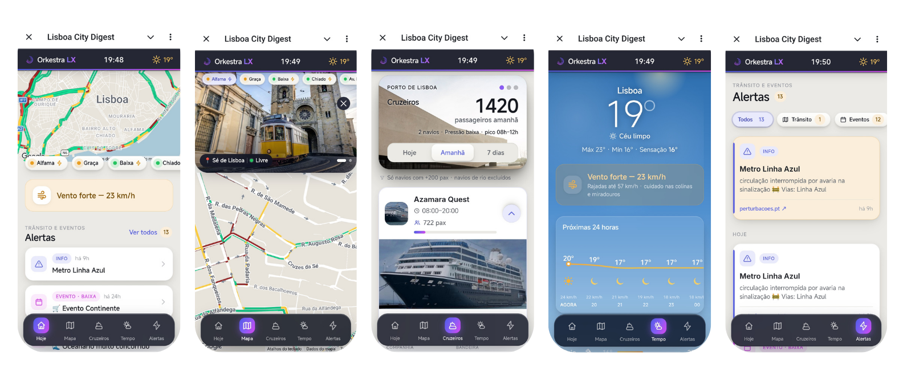
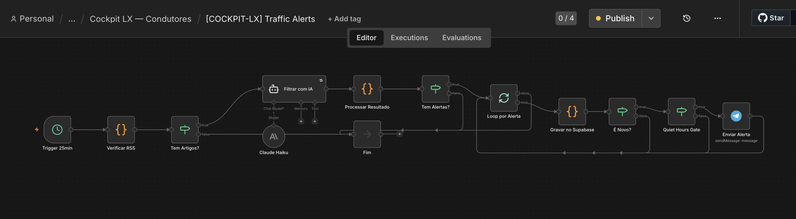

# Cockpit LX — Real-time Operational Dashboard for Tuk-tuk Drivers

**Status:** Pilot approved for production · **Domain:** Real-time operational monitoring — mobility (Lisbon, Portugal)
**Stack:** n8n (self-hosted) · Telegram Bot API · Telegram Mini App · multiple real-time data sources
**Pattern:** Tier 1 — Multi-source data pipeline + real-time delivery



---

## Problem

Tuk-tuk drivers in Lisbon operate in a fast-changing environment: cruise ship arrivals drive demand spikes, traffic restrictions block regular routes, weather affects outdoor tour viability, and city events create both opportunity and congestion.

Drivers had no centralised source for this information. Each variable required a different source, checked manually, with no alerts and no mobile-first interface. The result: missed demand peaks, inefficient routing, and reactive rather than proactive operations.

---

## Architecture

```
[Multiple data sources — continuous polling]
  ├─ Maritime traffic (cruise ship arrivals)
  ├─ Lisbon traffic & road restrictions
  ├─ Weather forecast API
  └─ City events calendar
        ↓
[n8n — deterministic aggregation + condition triggers]
        ↓
[Telegram Bot — push alerts to driver group]
        ↓
[Telegram Mini App — interactive dashboard]
  ├─ Real-time map
  ├─ Cruise arrival schedule
  ├─ Active traffic restrictions
  ├─ Weather forecast
  └─ Event summary
```



**Right tool per layer:** zone, cruise, and weather data are aggregated deterministically — rule-based, low-latency, no per-event LLM cost. For the noisier **alerts** feed, an LLM (Claude Haiku) filters raw news/RSS into genuinely driver-relevant items — interpretation a fixed rule handles poorly. Deduplication (Supabase) and a quiet-hours gate prevent alert fatigue before anything reaches the group.

**Delivery:** a Telegram group message with an inline button opens the Mini App dashboard directly within Telegram — no separate app install required.

---

## What runs autonomously

- Monitors maritime data for cruise arrivals in Lisbon port
- Monitors traffic API for active restrictions in key zones
- Fetches weather forecast at scheduled intervals
- Aggregates city events for the day
- Pushes contextual alerts to the driver Telegram group (~4–5 per day during active hours)
- Mini App renders all data in real-time on demand

## What escalates to a human

- Data source outage → operator notified
- Manual alert injection — operator can push a custom message to the group via an admin interface

---

## Results

- **4–5 operational alerts per day** delivered to the driver group
- **Pilot approved** by the operator — full team onboarding (~10 drivers)
- **Zero app-install friction** — the Telegram Mini App opens inside the existing Telegram interface
- **Extensible** to Porto, Algarve, and other cities by adding location-specific data sources to the existing pipeline

---

## What this demonstrates

A multi-source aggregation pipeline with real-time push delivery, where each layer uses the right tool: deterministic rules for structured data (zones, cruises, weather), and an LLM only where interpretation pays off (filtering noisy news into relevant alerts). It proves that agentic infrastructure means matching the tool to the problem — not applying AI uniformly.

The **Telegram Mini App pattern**: operational dashboards deployed inside an existing communication channel, eliminating adoption friction entirely.
