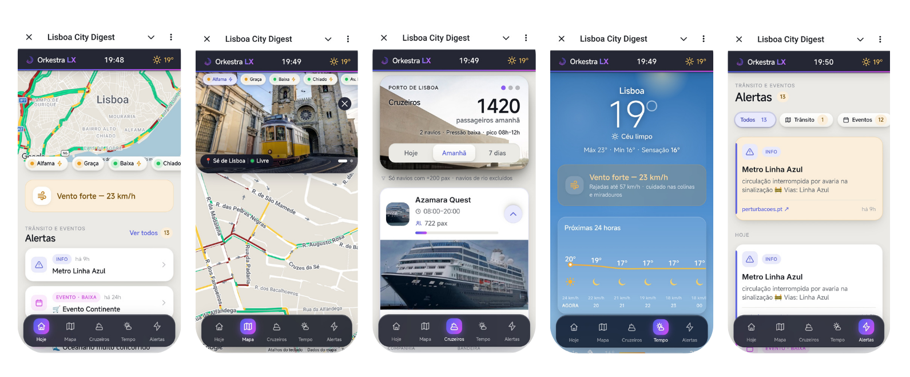
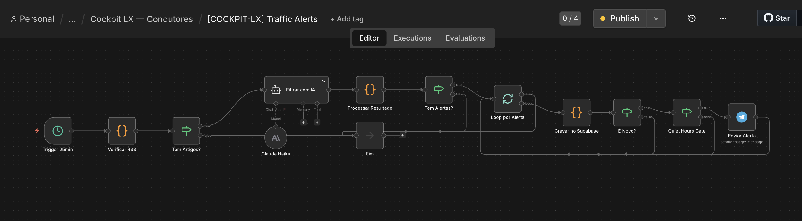

# Cockpit LX — Real-time Operational Dashboard for Tuk-tuk Drivers

**Status:** Pilot ran May–August 2026 · **Retired** · **Domain:** Real-time operational monitoring — mobility (Lisbon, Portugal)
**Stack:** n8n (self-hosted) · Telegram Bot API · Telegram Mini App · multiple real-time data sources
**Pattern:** Multi-source data pipeline + real-time delivery — deliberately rules-first



---

## Problem

Tuk-tuk drivers in Lisbon operated in a fast-changing environment: cruise ship arrivals drive demand spikes, traffic restrictions block regular routes, weather affects outdoor tour viability, and city events create both opportunity and congestion.

Drivers had no centralised source for this information. Each variable required a different source, checked manually, with no alerts and no mobile-first interface. The result: missed demand peaks, inefficient routing, and reactive rather than proactive operations.

---

## Architecture

```
[Multiple data sources — continuous polling]
  ├─ Maritime traffic (cruise ship arrivals)
  ├─ Lisbon traffic & road restrictions
  ├─ Weather forecast API
  └─ City events calendar
        ↓
[n8n — deterministic aggregation + condition triggers]
        ↓
[Telegram Bot — push alerts to driver group]
        ↓
[Telegram Mini App — interactive dashboard]
  ├─ Real-time map
  ├─ Cruise arrival schedule
  ├─ Active traffic restrictions
  ├─ Weather forecast
  └─ Event summary
```



**Right tool per layer:** zone, cruise, and weather data are aggregated deterministically — rule-based, low-latency, no per-event LLM cost. For the noisier **alerts** feed, an LLM (Claude Haiku) filters raw news/RSS into genuinely driver-relevant items — interpretation a fixed rule handles poorly. Deduplication (Supabase) and a quiet-hours gate prevent alert fatigue before anything reaches the group.

**Delivery:** a Telegram group message with an inline button opens the Mini App dashboard directly within Telegram — no separate app install required.

---

## What the system did on its own

- Monitored maritime data for cruise arrivals in Lisbon port
- Monitored the traffic API for active restrictions in key zones
- Fetched the weather forecast at scheduled intervals
- Aggregated city events for the day
- Pushed contextual alerts to the driver Telegram group (~5 per day during active hours)
- Rendered all data in the Mini App, in real time, on demand

## What it handed back to a person

- Data source outage → operator notified
- Manual alert injection — the operator could push a custom message to the group through an admin interface

---

## Results

- **325 operational alerts delivered** (~5 per day) to the driver group during the pilot
- **50 cruise-ship arrivals tracked** in Lisbon port
- **Zero app-install friction** — the Telegram Mini App opened inside the Telegram the drivers already had
- The pilot ran from May to August 2026 and was **retired on 18 August 2026**. The case study stays because the engineering decision it records is the point, not the uptime.

---

## What this demonstrates

A multi-source aggregation pipeline with real-time push delivery, where each layer used the right tool: deterministic rules for structured data (zones, cruises, weather), and an LLM only where interpretation pays off (filtering noisy news into relevant alerts). The tempting build here was an AI agent. The correct build was rules over live feeds — deterministic, fast, and incapable of inventing a cruise ship that isn't coming. Knowing which layer needs a model and which does not is most of the engineering.

The **Telegram Mini App pattern**: put the dashboard inside the channel the team already opens, and adoption stops being a training problem.
