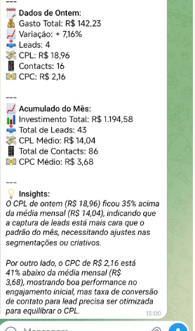

# Daily AI Reporting Agent — Traffic Manager Operations

**Status:** In production since April 2026 · **Domain:** Financial operations automation — B2B (Brazil)
**Stack:** n8n (self-hosted) · Claude API · Telegram Bot API · Supabase
**Pattern:** Tier 0 — Single agent + tools



---

## Problem

A traffic manager handling paid-media campaigns for multiple SME clients needed a daily summary of ad spend across accounts. The process was manual: open each platform, extract numbers, consolidate, format, send. Repetitive, error-prone, and consuming 30–45 minutes every morning before real work could start.

The core issue: a human was doing work that required no judgment — only data retrieval, calculation, and formatting.

---

## Architecture

```
[Cron trigger — daily 08:00]
        ↓
[n8n — fetch spend data from ad platforms]
        ↓
[Claude API — categorise anomalies, format narrative summary]
        ↓
[n8n — format Telegram message]
        ↓
[Telegram Bot — deliver to client's private channel]
```


A single-agent pipeline: deterministic data retrieval plus an agentic reasoning layer (Claude API) for anomaly detection and narrative generation. No human in the loop for routine execution.

---

## What runs autonomously

- Fetches daily ad-spend data across client accounts
- Calculates day-over-day variance and budget consumption rate
- Flags anomalies (spend spikes, underdelivery, budget exhaustion)
- Generates a human-readable narrative summary in Portuguese
- Delivers the formatted report to Telegram by 08:00 daily

## What escalates to a human

- Data source unavailable or returning an unexpected format
- Spend anomaly exceeding a defined threshold (requires a client decision)

---

## Results

- **37+ reports generated** without manual intervention (production since April 2026)
- Morning reporting time reduced from **~40 minutes to 0** on routine days
- Operator reviews the report in Telegram and acts only on flagged items
- **Zero missed days** since deployment

---

## What this demonstrates

The **Tier 0 agentic pattern**: a single agent + external tools + a scheduled trigger. Applicable to any operation where a human performs the same data-retrieval-and-formatting task daily — the minimum viable agent that replaces a specific repetitive task with measurable, auditable automation.
