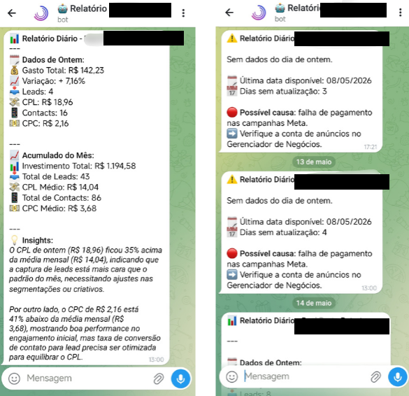

# Daily AI Reporting Agent — Traffic Manager Operations

**Status:** Ran in production from 10 April 2026 until the client engagement ended in August 2026 · **Domain:** Paid-media operations — B2B (Brazil)
**Stack:** n8n (self-hosted) · Claude API · Telegram Bot API · Supabase
**Pattern:** Single agent + tools + a scheduled trigger — the smallest useful shape of automation

<p align="center">
  
</p>

<sub>Real output in Telegram. **Left:** the daily report — spend, leads, CPL/CPC, month-to-date totals and an AI-generated narrative analysis (in Portuguese). **Right:** when yesterday's data is missing, the agent sends an alert with the probable cause it inferred (a payment failure on the ad platform). Client name redacted.</sub>

---

## Problem

A paid-media manager handling campaigns for multiple SME clients needed a daily summary of ad spend across accounts. The process was manual: open each platform, extract numbers, consolidate, format, send. Repetitive, error-prone, and consuming 30–45 minutes every morning before real work could start.

The core issue: a human was doing work that required no judgment — only data retrieval, calculation, and formatting.

---

## Architecture

```
[Cron trigger — daily 09:00]
        ↓
[n8n — fetch spend data from ad platforms]
        ↓
[Claude API — categorise anomalies, format narrative summary]
        ↓
[n8n — format Telegram message]
        ↓
[Telegram Bot — deliver to client's private channel]
```


A single-agent pipeline: deterministic data retrieval plus a reasoning layer (Claude API) for anomaly detection and narrative generation.

---

## What the system did on its own

- Fetched daily ad-spend data across client accounts
- Calculated day-over-day variance and budget consumption rate
- Flagged anomalies (spend spikes, underdelivery, budget exhaustion)
- Wrote a human-readable narrative summary in Portuguese
- Delivered the report to Telegram before the working day started

## What it handed back to a person

- Data source unavailable or returning an unexpected format
- Any spend anomaly above a defined threshold — that is a client decision, not the agent's

This one delivered without a human tap, and it could: the report went to the client's own private Telegram channel, not to end customers. Where a send can cost a business its channel, the decision stays with a person — see the [Live Portugal case study](live-portugal-ai-os.md).

---

## Results

- **90+ production days**, from 10 April 2026 until the engagement ended in August
- Morning reporting time cut from **about 40 minutes to roughly zero** on routine days
- The manager read the report in Telegram and acted only on flagged items

---

## What this demonstrates

The smallest useful shape of automation: a single agent, external tools, and a scheduled trigger. A different client, a different country, and a small system that gave back real recurring time — usually the first thing a business actually needs, before anything larger is worth building.
