# Live Portugal AI OS — an Operating System for a Tour Operator

**Status:** In production · **Domain:** Tour operations — Lisbon, Portugal
**Stack:** Next.js 15 (PWA) · Supabase · n8n (self-hosted) · Claude API · Evolution API (WhatsApp Business) · Google Calendar API
**Pattern:** AI Operating System — Design · Build · Embed

<p align="center">
  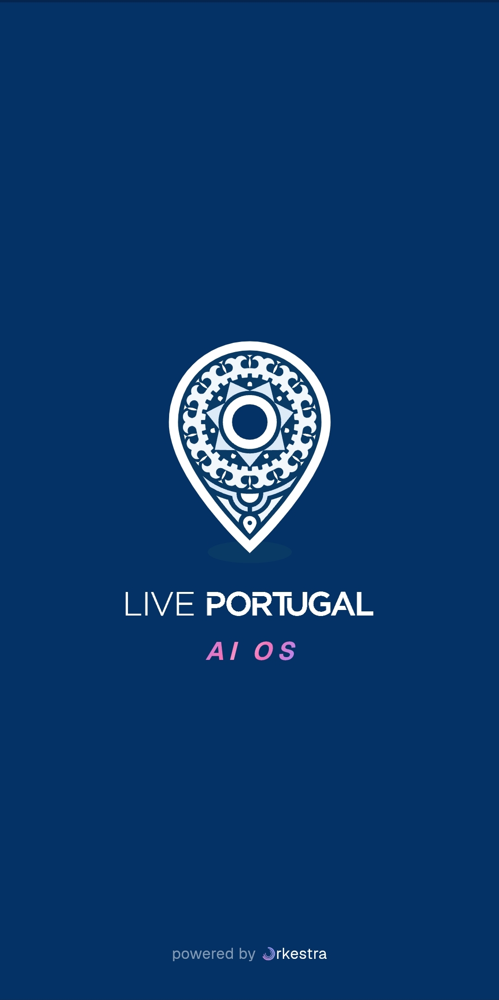
  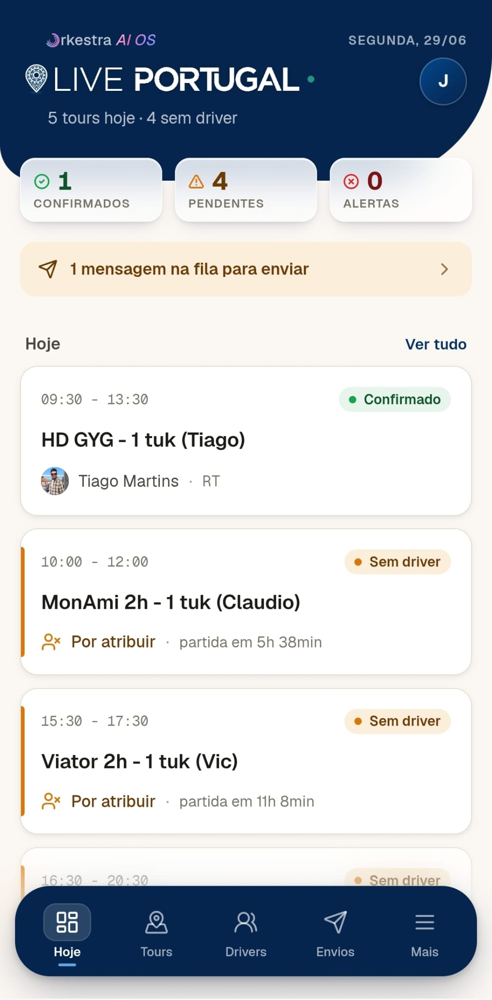
</p>
<p align="center"><em>The client's own brand, powered by Orkestra — and the daily cockpit behind it.</em></p>

---

## The problem

Live Portugal runs daily tuk-tuk tours across Lisbon for international clients. The whole operation lived in disconnected tools and in people's heads: bookings in Google Calendar, driver coordination over WhatsApp, the weekly roster on a printed grid, and reminders and reviews typed one by one in five languages. There was no single place to see the day — and the work that needed no judgment was eating the operator's hours.

The goal was not one automation. It was an **operating system for the operation**: one place to run the day, with the AI doing the repetitive work and the humans deciding direction.

---

## What I built

An AI OS embedded into the operation — an installable, mobile-first PWA backoffice, backed by autonomous workflows, running under the client's own brand. Below, the pieces, in the order the operator meets them through the day.

## See the day, drill into a booking

The cockpit opens on today: confirmed vs. unassigned tours, a send-queue nudge, and driver assignment in two taps. A week view gives the shape of the days ahead; tapping any tour opens the full booking — pickup, pax, client, and the assigned driver.

<p align="center">
  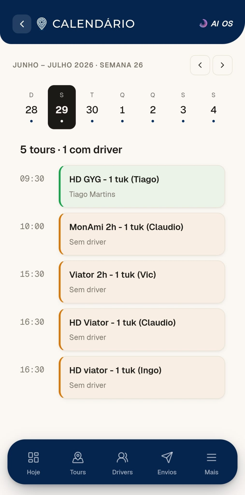
  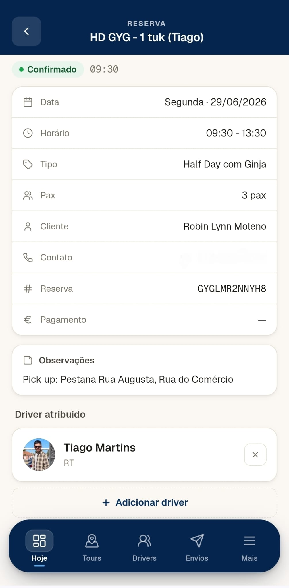
</p>

## The standout — an AI that reads the roster

The weekly roster was a printed grid no system could parse. Instead of forcing the operator to re-type it, they simply **photograph the grid and upload it**. Claude reads the image, detects the week, and proposes the tuk↔driver assignment for every day. The operator reviews and applies — minutes instead of an hour of manual entry, with the human always making the final call.

<p align="center">
  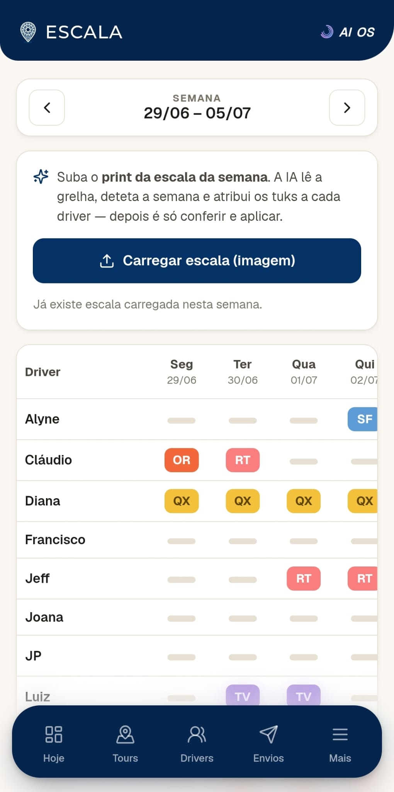
</p>

## The team, at a glance

Every driver, with live availability ("free now"), the vehicle they're on, and a profile with languages, history, and stats — so assigning the right person takes seconds.

<p align="center">
  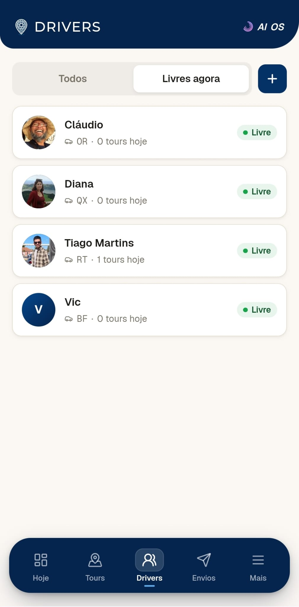
  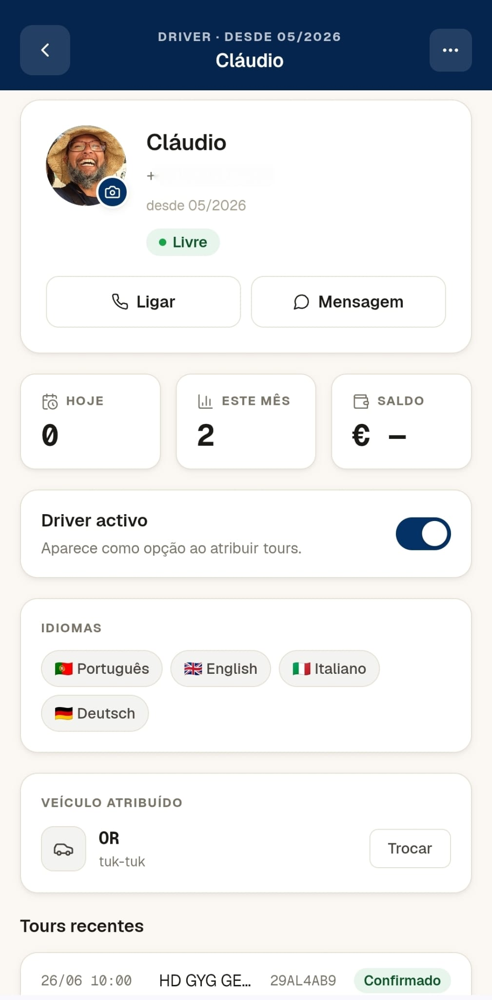
</p>

## Sends, in five languages

The send queue turns coordination into one tap: a briefing to the day's driver, a D-1 reminder to the client, a D+1 review request after the tour.

<p align="center">
  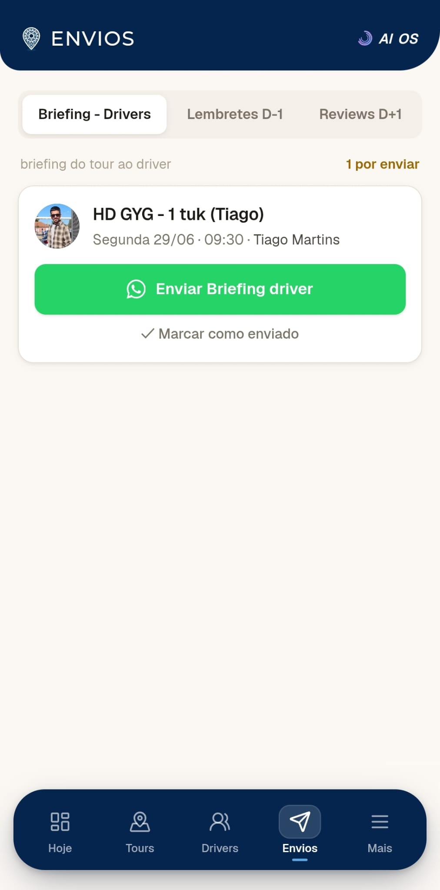
</p>

Behind the queue runs an autonomous pipeline. n8n reads bookings from Google Calendar, Claude writes a personalised message in the client's language (PT/EN/ES/DE/FR), Evolution API delivers it over WhatsApp Business, and Supabase logs the send.

```
[Google Calendar] → [n8n · D-1 17:00 / D+1 09:00] → [Claude — message in client's language]
                  → [WhatsApp Business] → [Supabase — log]
```

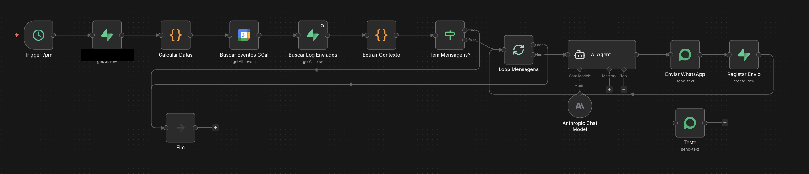

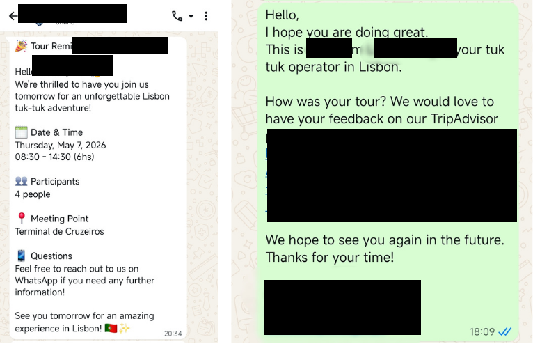

Multi-tenant from day one: one workflow set serves every operator tenant — a new operator is a database row, not a new deployment.

## In their brand, on their phone

It installs and runs as a real full-screen app on the operator's smartphone. A single menu holds the operation; integrations (Google Calendar, Stripe, GetYourGuide) and notifications live one screen away.

<p align="center">
  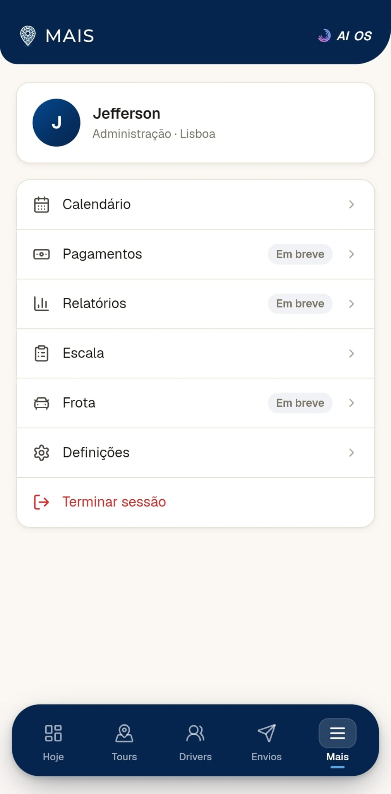
  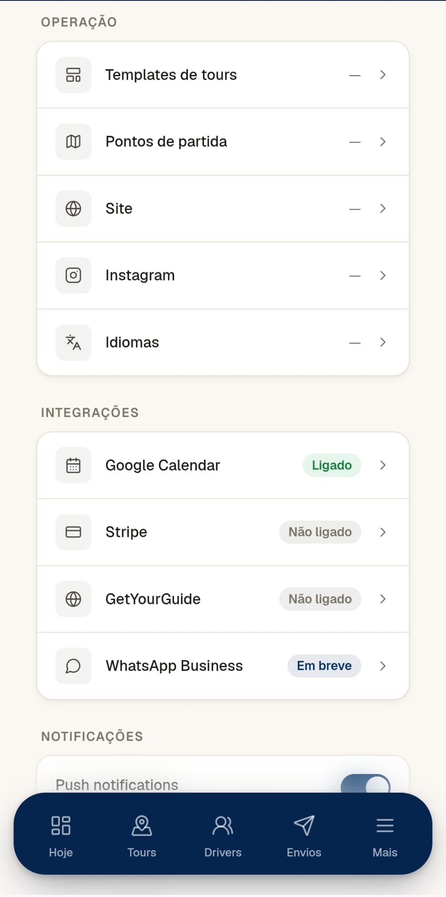
</p>

---

## What runs autonomously · what escalates

**Autonomous:** reads bookings from Google Calendar; reads the weekly-roster photo and proposes driver↔tuk assignments; generates D-1 reminders and D+1 review requests in the client's language; delivers via WhatsApp Business; logs every message and delivery status to Supabase.

**Escalates to the operator:** any cancellation or change request; delivery failures; replies outside expected patterns; roster assignments are always reviewed before they apply. Agents inform — the human decides direction.

---

## What this demonstrates

The full **Design → Build → Embed** of an AI OS into a live operation — not a single script, but a system the operator runs the day on, in their own brand. Built on the same AI OS I run on my own operation (dogfooding as proof). The multilingual WhatsApp pipeline is one capability inside a broader system that also covers the cockpit, the AI roster, driver management, and the send queue.

The pattern is replicable to any service operation with scheduling and field staff: tour operators, clinics, salons, property management, field services.
