# Live Portugal: the system that runs the day

**Status:** in production every day since May 2026 · **Domain:** tour operations, Lisbon, Portugal
**Stack:** Next.js 15 (PWA) · TypeScript · Supabase · n8n (self-hosted) · Claude API · WhatsApp Business · Google Calendar API

> **Full disclosure:** I am employed by this company. I built the system it runs on and I use it every day, so I live with its failures. Most engineers hand over and leave; I stayed and watched what broke.

**Measured (August 2026, this operator only):** around **20 hours of manual work removed per month**, across messaging, dispatch, the weekly schedule and the books · **414 messages** sent in six languages, **404 delivered** · **6,499 bookings** synced. The manager reviews and dispatches; nothing leaves without a person.

The screenshots below are from the demo tenant: same software, synthetic names.

---

## The problem

Live Portugal runs daily tuk-tuk tours across Lisbon for international clients. The whole day lived in disconnected tools and in people's heads. Bookings in Google Calendar. Driver coordination over WhatsApp. The week built by hand in a spreadsheet, exported as a picture and posted in the drivers' group. The accounts in other spreadsheets. Customer reminders typed one at a time, in six languages, by copying each booking into ChatGPT and pasting the answer into WhatsApp.

None of that work needed judgment. It was eating the managers' hours anyway.

The goal was not one automation. It was an AI operating system: the software the business opens every morning, one place to run the day, with the machine doing the repetitive part and the people deciding direction. It started with one question, how to stop typing every reminder by hand, and grew module by module until the whole operation lived in it: bookings, the weekly schedule, dispatch, the drivers' app, the messages, the money. The areas talk to each other because they are the same data.

---

## Four tasks, four before-and-afters

I measured the operation task by task. Each task below has its own number, and the four add up to the twenty hours.

### 1 · Customer messages · about 6 hours a month back

**Before:** five, ten, fifteen times a day someone copied a booking out of the calendar and into ChatGPT: name, pax, language, pick-up, time; then the right template out of a dozen; then WhatsApp, the number, paste, send. And again the next day for yesterday's customers, to ask for a review.

**Now:** the system reads the calendar itself and writes every message in the client's language: the D-1 reminder, the D+1 review request, the driver's briefing. Over a hundred a month land in a queue, ready.

**Sending is one tap, on purpose.** An automated send from the company's main number risked a ban on the very channel the business runs on. So a person releases each message, with a last look and the freedom to change it or not send it. The automation takes about ninety percent of the time out of this flow; what is left is the part that should stay human.

<p align="center"><a href="https://cdn.jsdelivr.net/gh/jefferson-orkestra/portfolio@main/videos/v2-comms.mp4">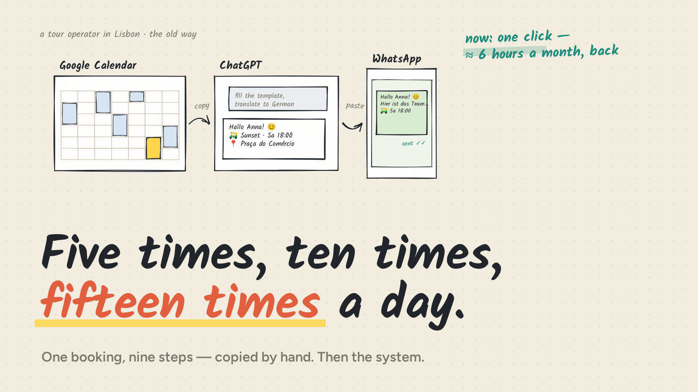</a></p>
<p align="center"><em>▶ <a href="https://cdn.jsdelivr.net/gh/jefferson-orkestra/portfolio@main/videos/v2-comms.mp4">Watch the 1:48 walkthrough</a></em></p>

<p align="center">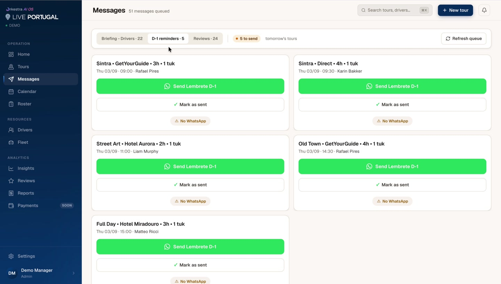</p>

```
[Google Calendar] → [n8n · D-1 17:00 / D+1 09:00] → [Claude · message in the client's language]
                  → [send queue] → 👤 one tap → [WhatsApp Business] → [Supabase · delivery log]
```

<p align="center">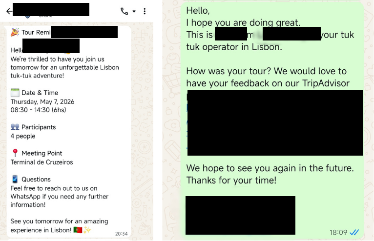</p>

### 2 · The weekly schedule · about 3 hours a month back

This one is not about replacing anyone's judgment. **The managers still build the schedule themselves, every week.** They know who works well with whom, who is back from holiday, who can take the German tour. That was never the problem.

**Before:** the problem was where the schedule lived. Built in a spreadsheet, exported as a picture, posted in the WhatsApp group. And there it stopped: a picture is a dead end, nothing downstream can read it. Every tour assignment meant going back to check who was working.

**Now:** a screen made for that job. Drag a driver into a day, drag a tuk into a cell, or click and type. One click publishes it as an image to the same WhatsApp group the team always used, and at the same moment it lands inside each driver's own app. Because the schedule became data instead of a picture, everything downstream got easier.

The hours here do not come from building the schedule faster. They come from no longer exporting and sharing by hand, and above all from no longer re-checking the schedule at every assignment.

<p align="center"><a href="https://cdn.jsdelivr.net/gh/jefferson-orkestra/portfolio@main/videos/v3-escala.mp4">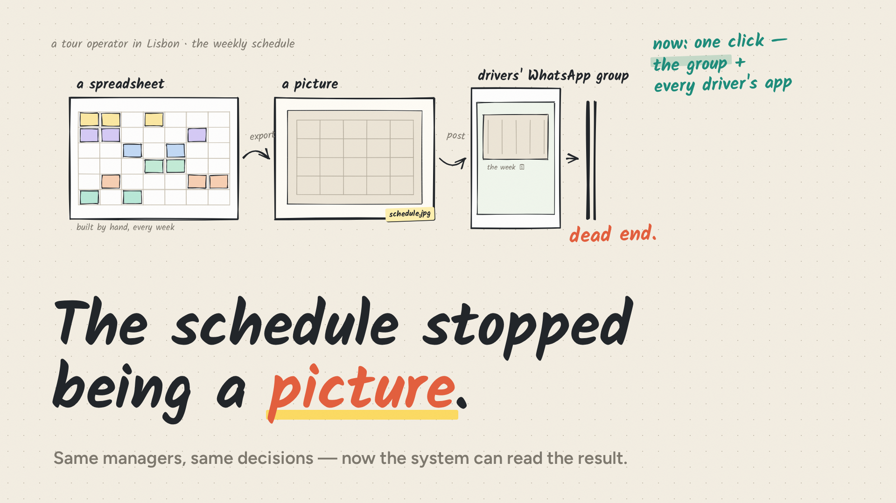</a></p>
<p align="center"><em>▶ <a href="https://cdn.jsdelivr.net/gh/jefferson-orkestra/portfolio@main/videos/v3-escala.mp4">Watch the 1:41 walkthrough</a></em></p>

<p align="center">
  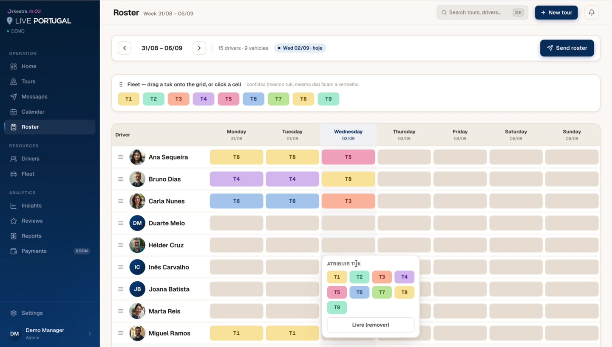
  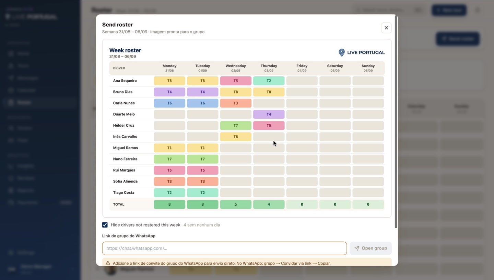
</p>

### 3 · Dispatch and the driver's app · about 4 hours a month back

**Before:** a tour for this afternoon meant opening the schedule to see who was working, working out who already had a tour at that hour, then calling drivers one by one, out in the street, mid-tour, to find out who was actually free. Then typing the briefing.

**Now:** one screen. The system has already read the week the managers built, every tour of the day, who is out on a street tour right now, who is on holiday, and which languages each driver speaks. It shows who can take this one, ranked by language and availability. One click assigns. When the manager dispatches, the driver's phone buzzes and the tour is in his own app: pick-up, time, language. He does not have to ask anyone anything. 128 briefings a month that used to be typed by hand.

Each driver has their own app and sees only their own work. Nothing reaches a driver before the manager dispatches.

<p align="center"><a href="https://cdn.jsdelivr.net/gh/jefferson-orkestra/portfolio@main/videos/v4-ops.mp4">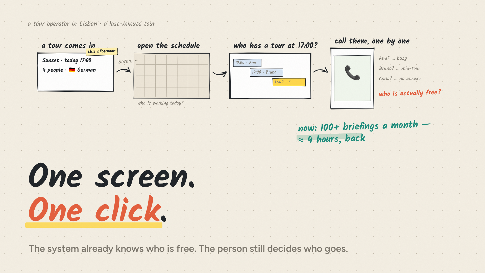</a></p>
<p align="center"><em>▶ <a href="https://cdn.jsdelivr.net/gh/jefferson-orkestra/portfolio@main/videos/v4-ops.mp4">Watch the 1:10 walkthrough</a></em></p>

<p align="center">
  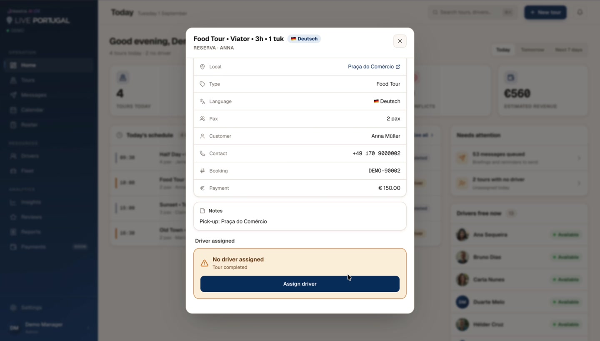
  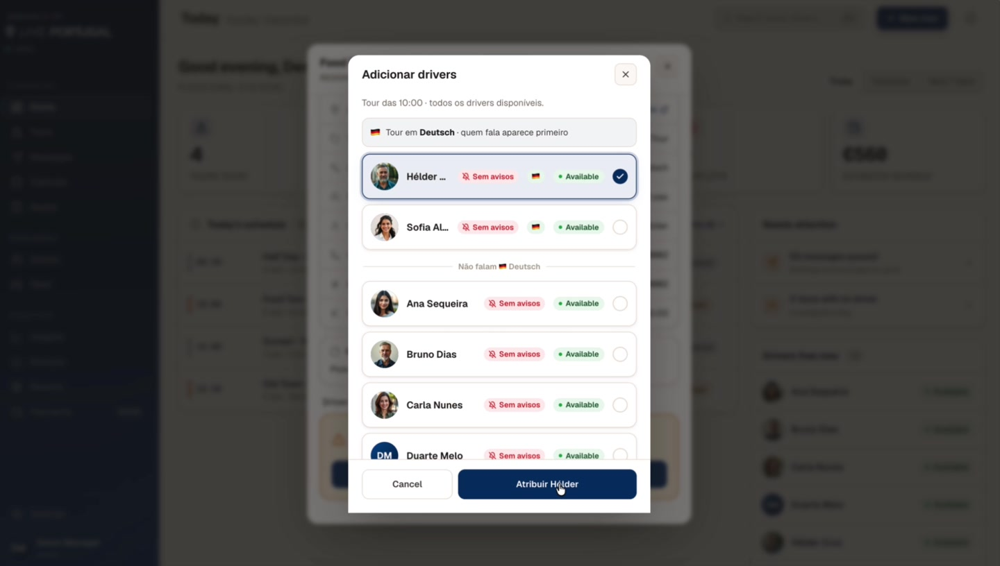
</p>
<p align="center">
  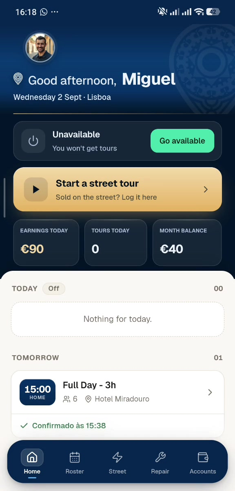
  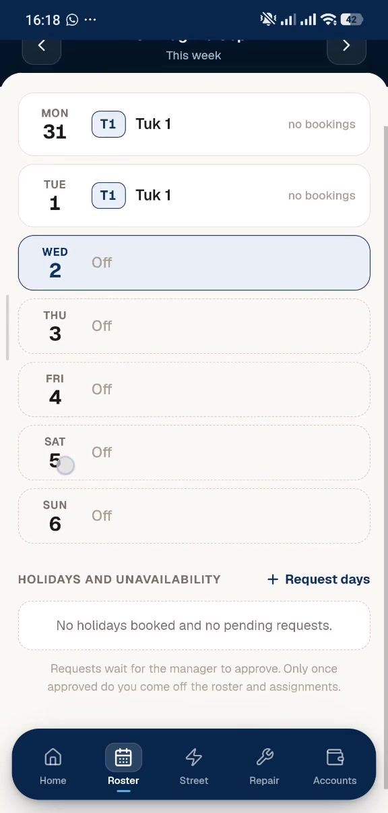
</p>

### 4 · The money · about 6 hours a month back

**Before:** each driver's balance lived in a spreadsheet, updated by hand. Each partner hotel's commission was worked out at the end of the month, from the calendar and another spreadsheet. The month-end close took an afternoon.

**Now:** the balance settles as each tour closes: what the driver received, what belongs to the company, what he is owed, at the moment the tour ends. Every partner's commission is calculated as the work happens, and the month-end report is ready without anyone reconciling. The close went from about three and a half hours to half an hour. This layer is plain deterministic code, because it has to be right.

<p align="center"><a href="https://cdn.jsdelivr.net/gh/jefferson-orkestra/portfolio@main/videos/v5-money.mp4">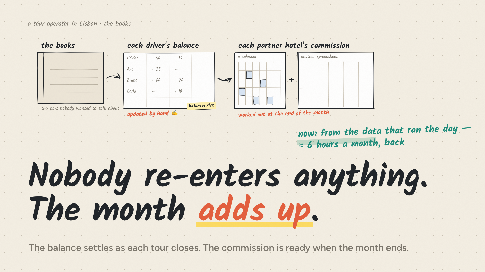</a></p>
<p align="center"><em>▶ <a href="https://cdn.jsdelivr.net/gh/jefferson-orkestra/portfolio@main/videos/v5-money.mp4">Watch the 1:03 walkthrough</a></em></p>

<p align="center">
  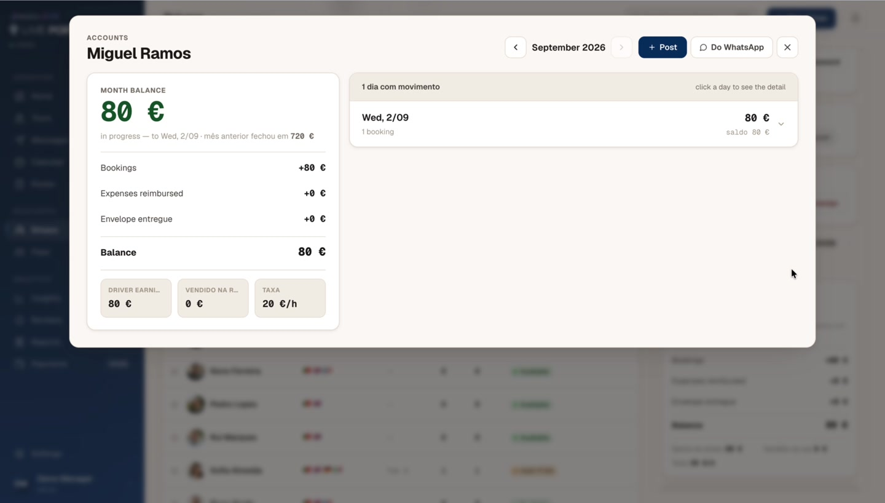
  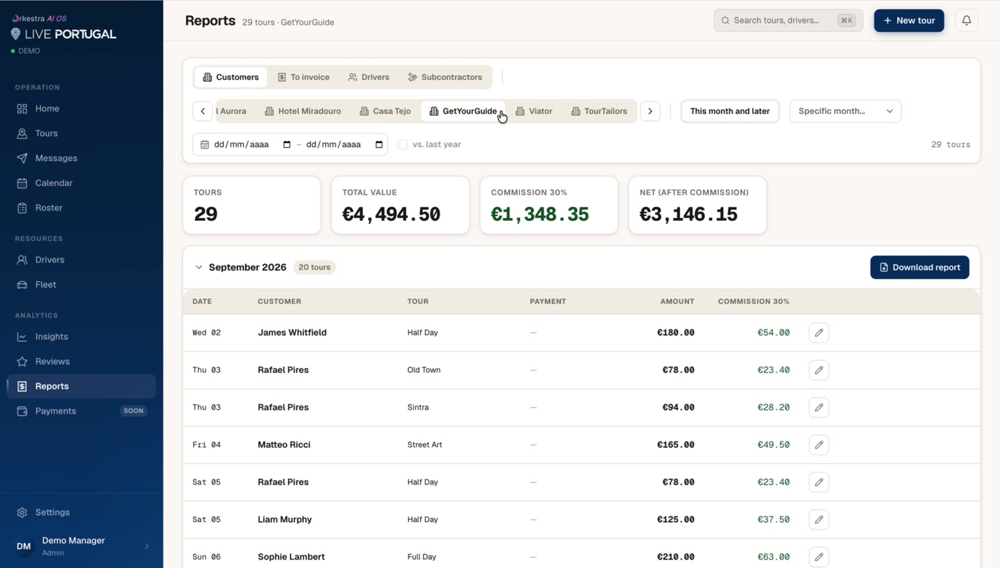
</p>

---

## The seam: nothing is typed twice

The biggest cost was never one task. It was the operation living in tools that did not talk to each other. Every booking is read once. The same data that writes the customer's message later tells the system which driver can take the tour and in which language. The schedule the managers build is what the assignment picker reads. And when the driver closes the tour in his app, his balance closes with it. That is where the interconnection stops being an architecture argument and becomes a productivity one: the time saved by not going back, not re-checking, not rewriting what already exists.

<p align="center">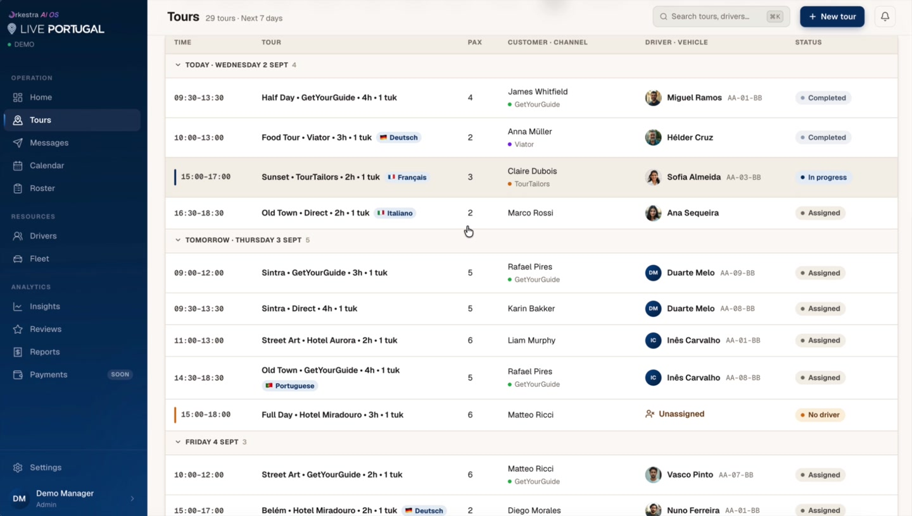</p>

---

## What the system does on its own · what it hands back to a person

**On its own:** reads bookings from Google Calendar; writes D-1 reminders, D+1 review requests and driver briefings in the client's language and queues them; publishes the schedule the managers built to the group and to each driver's app; proposes the drivers who can take a tour; settles each driver's balance as a tour closes; calculates each partner's commission; logs every message and delivery status.

**Handed back to a person:** **every customer send**, nothing reaches a client without someone tapping; **building the schedule**, always; **who goes**, the dispatch itself; any cancellation or change request; delivery failures; replies outside expected patterns.

The line is deliberate and it is the whole design: the machine prepares, the person decides.

---

## Where the model goes, and where it does not

| Layer | What it needs | Here |
|---|---|---|
| Structured, rule-shaped data | Deterministic code. No model, no per-event cost, nothing to hallucinate | Balances, commissions, the month-end close, availability |
| Writing for a human reader | A model generating; a person deciding when it goes out | Customer messages and driver briefings in six languages |
| Judgment about people | A person, always | Who works when, who takes which tour |
| Anything that leaves the building | A person, always | WhatsApp sends, dispatch, cancellations |

Multi-tenant from day one: a new operator is a database row, not a deployment.

---

## What this demonstrates

Not a demo and not a prototype: the software a business opens every morning, in production every day since May 2026, built and operated by the same person. Most of it is the part operational software usually never reaches: dispatching a field team, the app the worker actually uses, and the money that has to reconcile at the end of the month.

It also shows where AI does not belong. The schedule is built by the managers because it is a judgment about people. The balances are plain code because they must be right. The customer send is a human decision because the cost of being wrong is the channel the business runs on.
