# Live Portugal — the system that runs the day

**Status:** In production every day since May 2026 · **Domain:** Tour operations — Lisbon, Portugal
**Stack:** Next.js 15 (PWA) · TypeScript · Supabase · n8n (self-hosted) · Claude API · WhatsApp Business · Google Calendar API

> **Full disclosure:** I am employed by this company. I built the system it runs on and I use it every day, so I live with its failures. Most engineers hand over and leave; I stayed and watched what broke.

**Measured:** 6 hours of manual work removed per week · first customer response down from about 2 hours to under 1 minute · 279 of 281 messages delivered (99.3%) across 6 languages · 6,183 bookings synced · 83 driver dispatches across 76 tours · about 180 customer touchpoints a month.

<p align="center">
  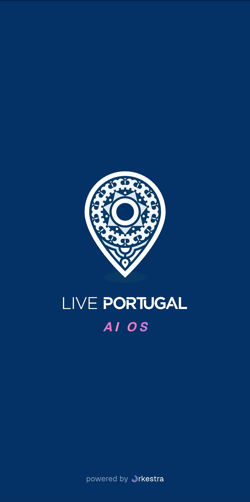
  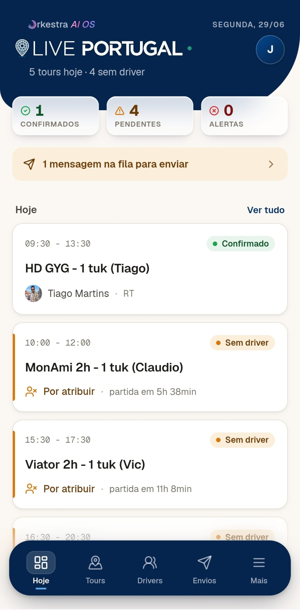
</p>
<p align="center"><em>The operator's own brand — and the daily cockpit behind it.</em></p>

---

## The problem

Live Portugal runs daily tuk-tuk tours across Lisbon for international clients. The whole operation lived in disconnected tools and in people's heads: bookings in Google Calendar, driver coordination over WhatsApp, the weekly roster on a printed grid taped to a wall, and reminders and reviews typed one by one in six languages. There was no single place to see the day — and the work that needed no judgment was eating the operator's hours.

The goal was not one automation. It was the software the business opens every morning: one place to run the day, with the machine doing the repetitive work and the people deciding direction.

---

## What I built

An installable, mobile-first PWA backoffice running under the operator's own brand, backed by scheduled workflows. Below, the pieces, in the order the operator meets them through the day.

## See the day, drill into a booking

The cockpit opens on today: confirmed vs. unassigned tours, a send-queue nudge, and driver assignment in two taps. A week view gives the shape of the days ahead; tapping any tour opens the full booking — pickup, pax, client, and the assigned driver.

<p align="center">
  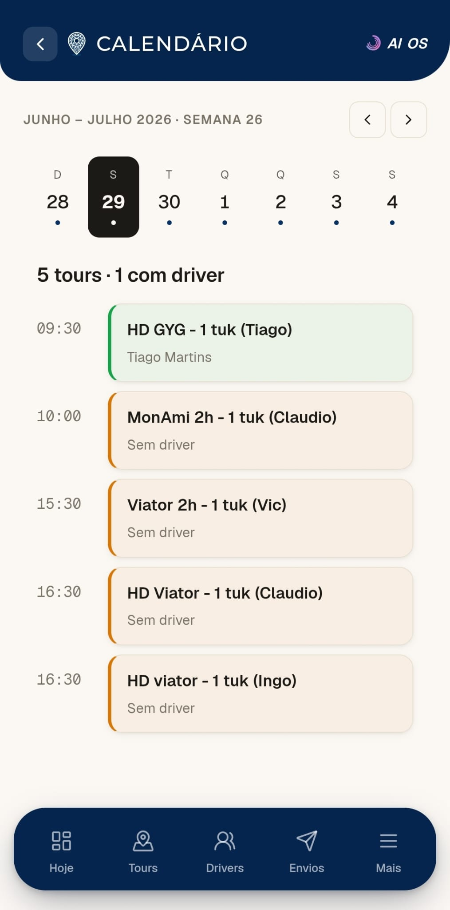
  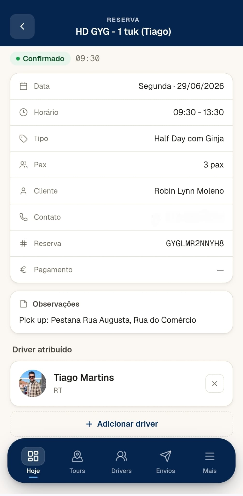
</p>

## The standout — reading the roster from a photograph

The weekly roster was a printed grid no system could parse. No scheduling form was ever going to beat that grid, so I did not replace it: the operator **photographs it and uploads it**. Claude reads the image, detects the week, and proposes the tuk↔driver assignment for every day. The operator reviews and applies — minutes instead of an hour of manual entry, with the human always making the final call.

<p align="center">
  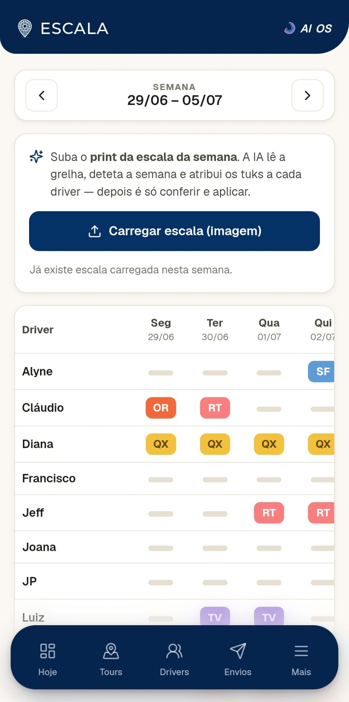
</p>

## The team, at a glance

Every driver, with live availability ("free now"), the vehicle they're on, and a profile with languages, history, and stats — so assigning the right person takes seconds. 15 drivers across 6 vehicles.

<p align="center">
  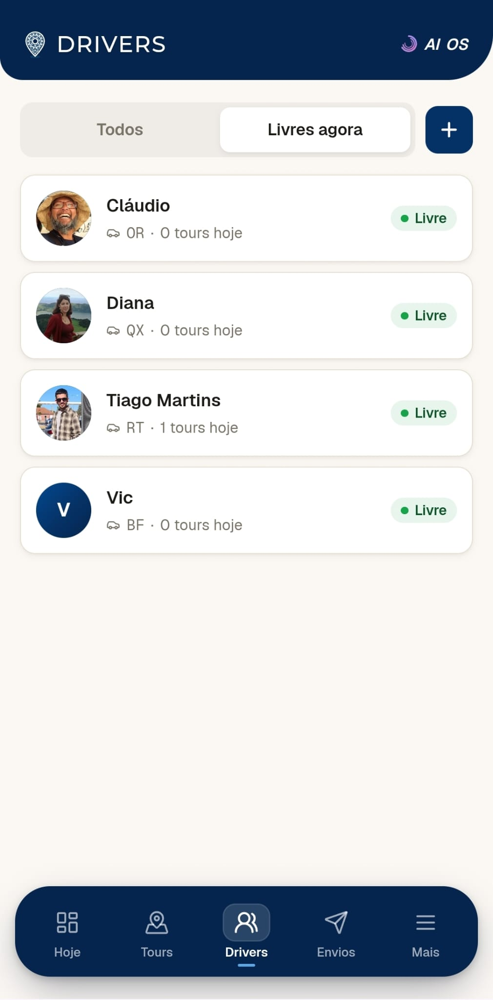
  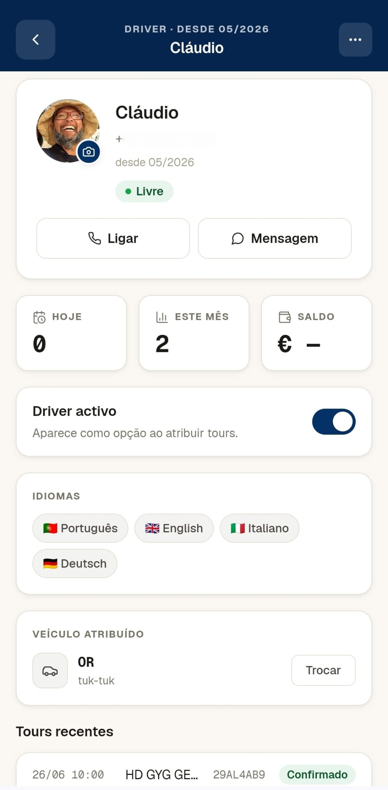
</p>

## Messages in six languages — written automatically, sent with one tap

The send queue turns coordination into one tap: a briefing to the day's driver, a D-1 reminder to the client, a D+1 review request after the tour.

<p align="center">
  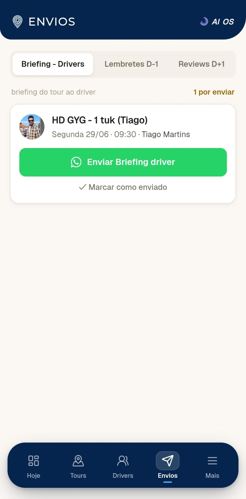
</p>

Behind the queue, the writing is automatic and the sending is not. n8n reads bookings from Google Calendar, Claude writes a personalised message in the client's language (PT/EN/ES/DE/FR/IT), and the message lands in the queue with the delivery status logged in Supabase.

**Sending is one tap, by design.** Automated delivery from the company's main number risked a ban on the very channel the business runs on, so a person releases each message. That is a deliberate constraint, not a missing feature — the official Meta channel is the next phase.

```
[Google Calendar] → [n8n · D-1 17:00 / D+1 09:00] → [Claude — message in the client's language]
                  → [send queue] → 👤 one tap → [WhatsApp Business] → [Supabase — log]
```

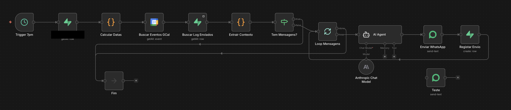


Multi-tenant from day one: one workflow set serves every operator tenant — a new operator is a database row, not a new deployment.

## In their brand, on their phone

It installs and runs as a real full-screen app on the operator's smartphone. A single menu holds the operation; integrations (Google Calendar, Stripe, GetYourGuide) and notifications live one screen away.

<p align="center">
  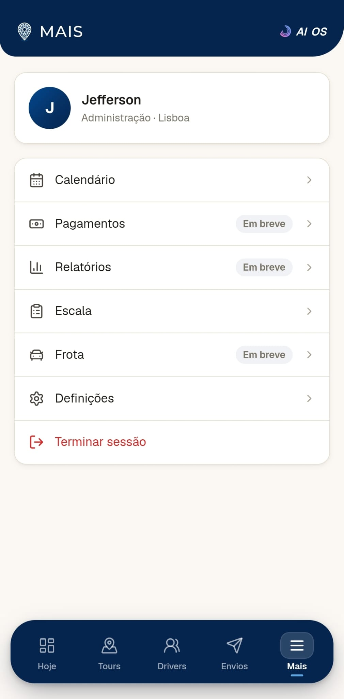
  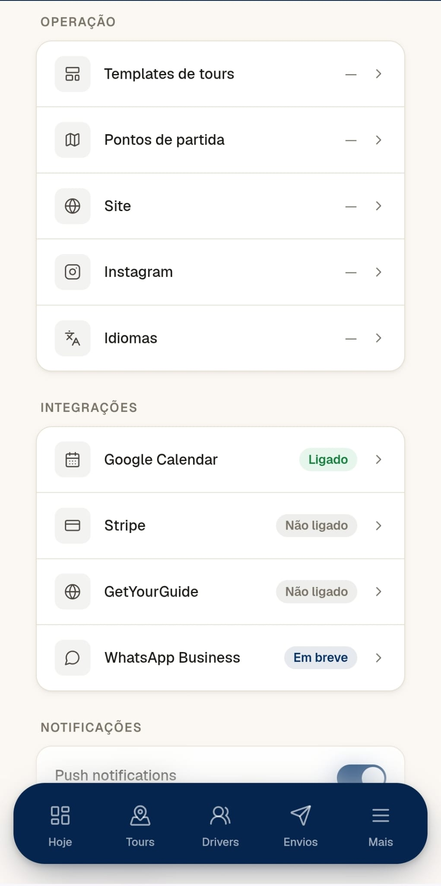
</p>

---

## What the system does on its own · what it hands back to a person

**On its own:** reads bookings from Google Calendar; reads the weekly-roster photograph and *proposes* driver↔tuk assignments; writes D-1 reminders and D+1 review requests in the client's language and queues them; settles each driver's balance as a tour closes; calculates each partner hotel's commission as the work happens; logs every message and delivery status to Supabase.

**Handed back to a person:** **every customer send** — nothing reaches a client without someone tapping; roster assignments, always reviewed before they apply; any cancellation or change request; delivery failures; replies outside expected patterns.

The line is deliberate and it is the whole design: agents inform, humans decide direction.

---

## What this demonstrates

Not a demo and not a prototype — the software a business opens every morning, in production every day since May 2026, built and operated by the same person. Most of it is the part operational software usually never reaches: dispatching a field team, the app the worker actually uses, and the money that has to reconcile at the end of the month.

It also shows where a model does *not* belong. The roster is read by a model because a photographed grid is genuinely messy input; the balances and commissions are plain deterministic code because they must be right; and the customer send is a human decision because the cost of being wrong is the channel the business runs on.
